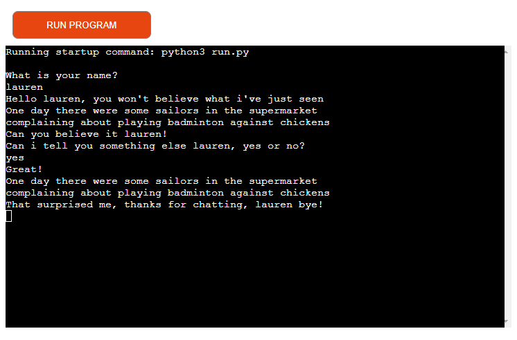
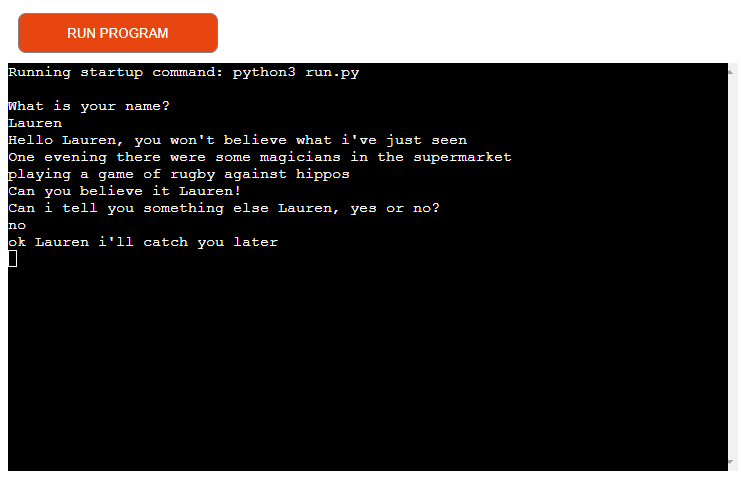
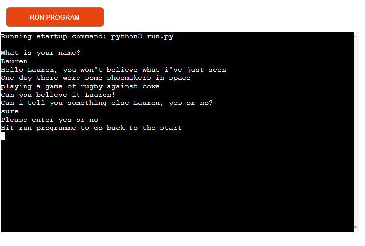
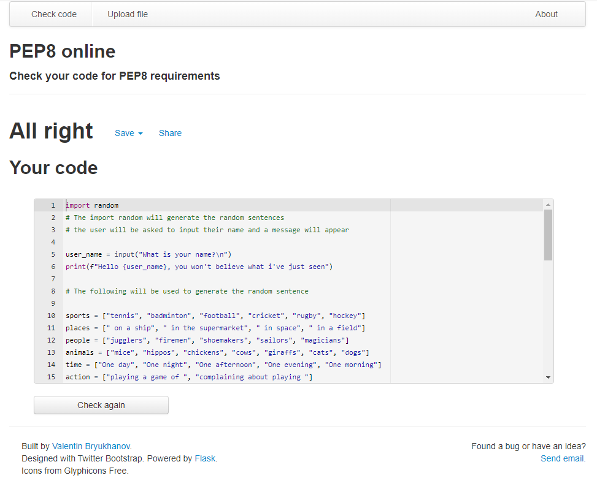
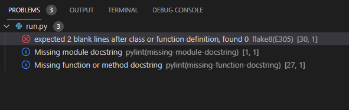

# Project 3 - Sentence Generator 

## The purpose of this code is to generate a simple sentence for it's users. 

## How to Play

In order to generate a sentence the user only needs to enter their name to get the code to start running a random sentence will auto matically print on  the screen 

## Features

After the first sentence has been printed the programme will then ask the user if it can tell them something else, yes or no? if the user answers yes it will generate another sentence, thank the user and say bye as shown in the first image, If the User says no it will say bye to the user as shown in the second image, If the user input is anythin other than yes or no, it will ask the user to enter yes or no and instruct them to hit the run programme button at the top to got back the the start.

    

 ## Future Features

 In the future i would like to inlcude more user inputs to give the user a chance to genarate something random with their own details. 

 ## Testing

 - Tested the Pthon code on PEP8, you'll see in the image below that it can back without errors, however an error is highlighted in the GitHub terminal, i tried to find a solution to the error but failed to find one. please see a screenshot of these below.  
 
 
 

 # Deployment
This prjected was deployed using the Code Institutes mock terminal for Heroku and following their instructions

my project can be found following this link - https://sentence-generator1.herokuapp.com/ 

# Credits

- Code Institute for deployment terminal
- Ws3 schools python condtions page https://www.w3schools.com/python/python_conditions.asp